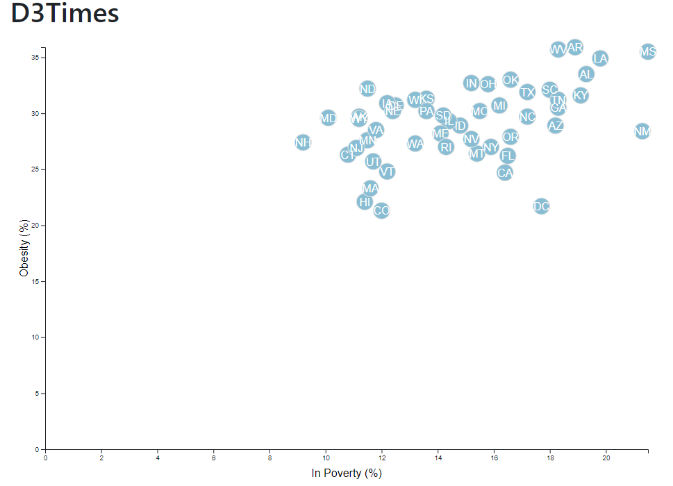

# D3 Scatter Plots
## Overview
The aim of this project was to take data from the U.S. Census Bureau and the Behavioral Risk Factor Surveillance System and create a D3 scatter plot. The CSV file containing the data is available in **assets->data->data.csv**. The js app is in **assest->js->app.js**. The **app.js** file reads in the **data.csv** and creates a scatter plot based on the data. I chose to look at the correlation between obesity and poverty. The correlation between any two data variables could be done easily just by changing to the desired in the **app.js** file. 
## Outcomes
Here is what the scatter plot looks like:

## Future Directions
I would like to add a hover feature where when you hover over each item it shows you the actual value and I would like to try to make it interactive with multiple clickable axis. Then I could look at many different correlations by simply clicking on different axis options. 
